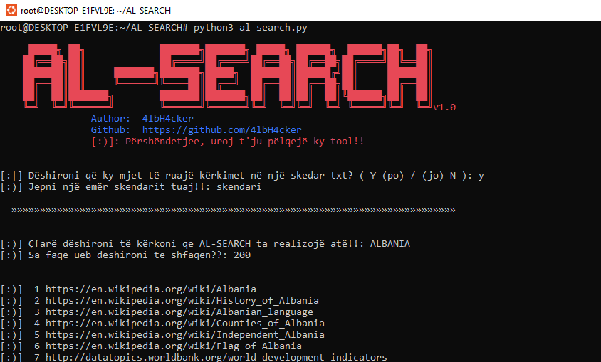

## AL-SEARCH /EN

AL-SEARCH is a script I made in python 3. With this tool, you can easily find Google sites. AL-SEARCH collects potentially vulnerable web pages and applications on the Internet or other awesome info that is picked up by Google's search bots. 

****
You can save the output in a file so that you can view it at a later time. You can determine the number of searches yourself. The number of websites to display!!

You can also use AL-SEARCH as a command-line interface (CLI) to quickly search through Google. AL-SEARCH shows only the links, without advertising, and is and is also fast!! (:)

But be careful not to overdo it, otherwise, you have a chance that If you perform too many requests over a short period, Google will start to throw captchas at you. This is annoying and will limit how much or how fast you do the search.
****

## AL-SEARCH /AL

AL-SEARCH është një skript që kam bërë në python 3. Me këtë mjet, ju mund të gjeni lehtësisht faqet e Google. AL-SEARCH mbledh ueb faqe dhe aplikacione potencialisht të cenueshme në internet ose informacione të tjera të mrekullueshme që merren nga robotët e kërkimit të Google.

****
Ju mund ta ruani daljen në një skedar në mënyrë që ta shihni më vonë. Ju mund ta përcaktoni vetë numrin e kërkimeve. Numri i faqeve të internetit për të shfaqur!!

Ju gjithashtu mund të përdorni AL-SEARCH si një ndërfaqe të linjës së komandës (CLI) për të kërkuar shpejt përmes Google. AL-SEARCH tregon vetëm lidhjet, pa reklama, dhe është gjithashtu i shpejtë!! (:)

Por kini kujdes të mos e teproni, përndryshe, keni një shans që nëse kryeni shumë kërkesa për një periudhë të shkurtër, Google do të fillojë t'ju hedhë captcha. Kjo është e bezdisshme dhe do të kufizojë sa ose sa shpejt e bëni kërkimin.
****

# What data can we find? /EN

Username and passwords
Admin login pages
Sensitive documents
Govt/military data
Email lists
Bank account details
Vulnerable websites
So much more …
****

# Çfarë të dhënash mund të gjejmë? /AL

Emri i përdoruesit dhe fjalëkalimet
Faqja e hyrjes së administratorit
Dokumente të ndjeshme
Të dhënat qeveritare/ushtarake
Listat e postës elektronike
Detajet e llogarisë bankare
Faqet e internetit të cenueshme
Shumë më tepër...
****

## Install AL-SEARCH /EN
A prerequisite for a script that I make must be that it is simple and easy to use and understand for everyone.

AL-SEARCH has tested it so far on:
* Kali Linux
* Termux

This list would be expanded
****

AL-SEARCH is written for Python 3. Clone the git repository and install the requirements.
****

## Instaloni AL-SEARCH /AL
Një parakusht për një skenar që bëj duhet të jetë që ai të jetë i thjeshtë dhe i lehtë për t'u përdorur dhe kuptuar për të gjithë.

AL-SEARCH ësht testuar deri më tani në:
* Kali Linux
* Termux

Kjo listë do të zgjerohej
****

AL-SEARCH është shkruar për Python 3. Klononi depon e git dhe instaloni kërkesat.
****

# Linux
sudo git clone https://github.com/4lbH4cker/AL-SEARCH

cd AL-SEARCH

pip3 install -r requirements.txt

# AL-SEARCH Usage Linux

sudo python3 al-search.py
****

# Termux

git clone https://github.com/4lbH4cker/AL-SEARCH

cd AL-SEARCH

pip3 install -r requirements.txt

# Usage Termux

python al-search.py
****

****

## I also want to make you aware that: /EN
* This was written for educational purpose and pentest only.
* The author will not be responsible for any damage ..!
* The author of this tool is not responsible for any misuse of the information.
* You will not misuse the information to gain unauthorized access.
* This information shall only be used to expand knowledge and not for
causing malicious or damaging attacks.
* Performing any hacks without written permission is illegal ..!
****

## Unë gjithashtu dua t'ju bëj të vetëdijshëm se: /AL
* Kjo është shkruar vetëm për qëllime edukative dhe pentest.
* Autori nuk do të jetë përgjegjës për asnjë dëm..!
* Autori i këtij mjeti nuk është përgjegjës për çdo keqpërdorim të informacionit.
* Ju nuk do të keqpërdorni informacionin për të fituar akses të paautorizuar.
* Ky informacion do të përdoret vetëm për të zgjeruar njohuritë dhe jo për
duke shkaktuar sulme keqdashëse ose të dëmshme.
* Kryerja e çdo hakeri pa leje me shkrim është e paligjshme ..!
****